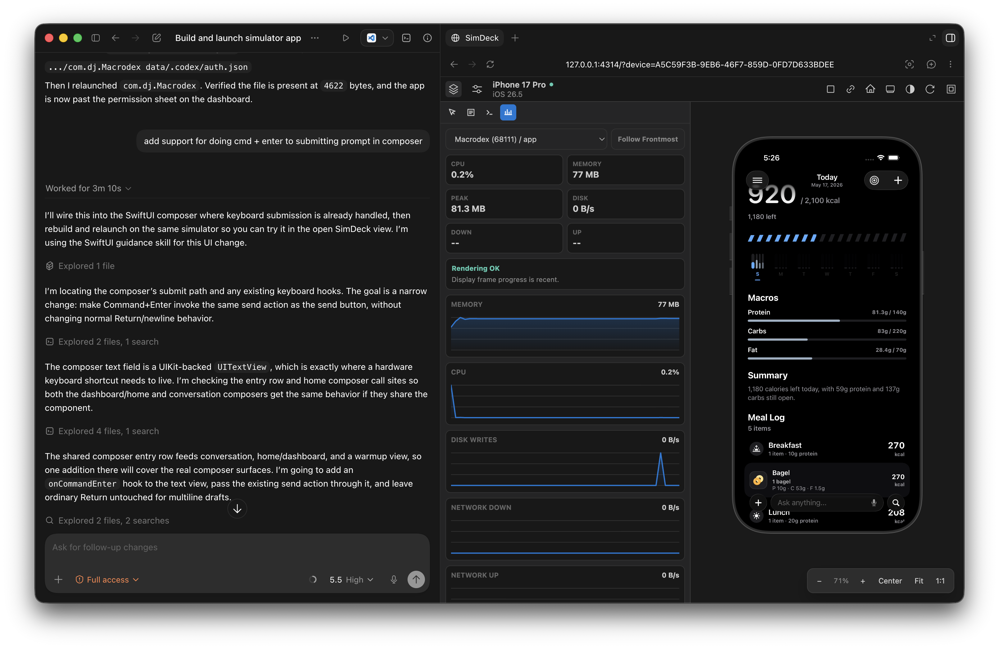

<p align="center">
  

  <h1 align="center">SimDeck</h1>

  <p align="center">
    SimDeck is a developer tool built for streamlining mobile app development using agents.
    Drive iOS Simulators and Android emulators from browser & CLI.
  </p>
</p>

<hr/>



## Try it out

```sh
npx simdeck
```

Open the URL in your IDE of choice, for example in-app browser in Codex.

Install the CLI globally for agentic-use:

```sh
npm i -g simdeck@latest
```

After installing the CLI, install the Codex skill so agents know the stable
SimDeck workflow:

```sh
npx skills add NativeScript/SimDeck --skill simdeck -g
```

For VS Code, install the [`nativescript.simdeck-vscode`](https://marketplace.visualstudio.com/items?itemName=NativeScript.simdeck-vscode) extension to open the simulator
view inside the editor.

## Features

- Supports streaming both iOS simulators and Android emulators
- Full simulator control & inspection using private iOS accessibility APIs and Android UIAutomator - available using `simdeck` CLI
- Real-time screen `describe` command using accessibility view tree - available in token-efficient format for agents
- Profiling built-in: CPU, memory, disk writes, network throughput, hang signals, and stack sampling
- CoreSimulator chrome asset rendering for device bezels
- NativeScript, React Native, Flutter, UIKit and SwiftUI runtime inspector plugins to debug app's view hierarchy live
- `simdeck/test` for fast JS-based app tests that can query accessibility state and drive simulator controls

## Documentation

Full documentation lives at [simdeck.nativescript.org](https://simdeck.nativescript.org/), with guides, the CLI reference, the REST API, the video pipeline, and the inspector protocols.

For hosted pull request simulator sessions, use the GitHub Actions integration
documented in the [GitHub Actions guide](https://simdeck.nativescript.org/guide/github-actions).

## Quick start

```sh
simdeck
```

To focus a specific simulator by name or UDID, pass it as the only argument:

```sh
simdeck "iPhone 17 Pro Max"
```

`simdeck -d` for detached start, `simdeck -k` to kill the background daemon, and `simdeck -r` to restart it.

The served loopback browser UI receives the generated API access token automatically.
LAN clients should pair with the printed code before receiving the API cookie.

For pairing with SimDeck iOS app:

```sh
simdeck pair
```

This starts or refreshes the global LaunchAgent-backed SimDeck service, prints
local, LAN, and Tailscale URLs when available, and shows a QR code with a
`simdeck://pair` link. The QR contains the pairing code plus all detected
non-loopback addresses, so pairing once can save both the LAN and Tailscale
routes with the same service token.

CLI commands automatically use the same warm daemon:

```sh
simdeck list
simdeck tap <udid> 0.5 0.5 --normalized
simdeck describe <udid> --format agent --max-depth 2
```

## Daemon

Manage the project daemon explicitly when needed:

```sh
simdeck daemon start
simdeck daemon restart
simdeck daemon status
simdeck daemon stop
simdeck daemon killall
```

`simdeck daemon` manages the normal per-project warm process. `daemon killall`
stops SimDeck daemons across all workspaces.

Use software H.264 when the hardware encoder is unavailable, busy, or starved
by screen recording:

```sh
simdeck daemon start --video-codec software
```

Restart the CoreSimulator service layer when `simctl` reports a stale service
version or the live display gets stuck before the first frame:

```sh
simdeck core-simulator restart
```

You can also start or stop the CoreSimulator service layer explicitly:

```sh
simdeck core-simulator start
simdeck core-simulator shutdown
```

## CLI

```sh
simdeck list
simdeck boot <udid>
simdeck shutdown <udid>
simdeck erase <udid>
simdeck install <udid> /path/to/App.app
simdeck install <udid> /path/to/App.ipa
simdeck install android:<avd-name> /path/to/app.apk
simdeck uninstall <udid> com.example.App
simdeck open-url <udid> https://example.com
simdeck launch <udid> com.apple.Preferences
simdeck toggle-appearance <udid>
simdeck pasteboard set <udid> "hello"
simdeck pasteboard get <udid>
simdeck screenshot <udid> --output screen.png
simdeck screenshot <udid> --with-bezel --output screen-bezel.png
simdeck record <udid> --seconds 5 --output screen-recording.mp4
simdeck stream <udid> --frames 120 > stream.h264
simdeck describe <udid>
simdeck describe <udid> --format agent --max-depth 4
simdeck describe <udid> --point 120,240
simdeck wait-for <udid> --label "Welcome" --timeout-ms 5000
simdeck assert <udid> --id login.button --source auto --max-depth 8
simdeck tap <udid> 120 240
simdeck tap <udid> --label "Continue" --wait-timeout-ms 5000
simdeck swipe <udid> 200 700 200 200
simdeck gesture <udid> scroll-down
simdeck pinch <udid> --start-distance 160 --end-distance 80
simdeck rotate-gesture <udid> --radius 100 --degrees 90
simdeck touch <udid> 0.5 0.5 --phase began --normalized
simdeck touch <udid> 120 240 --down --up --delay-ms 800
simdeck key <udid> enter
simdeck key-sequence <udid> --keycodes h,e,l,l,o
simdeck key-combo <udid> --modifiers cmd --key a
simdeck type <udid> "hello"
simdeck type <udid> --file message.txt
simdeck button <udid> lock --duration-ms 1000
simdeck button <udid> volume-up
simdeck button <udid> action --duration-ms 1000
simdeck button <udid> digital-crown
simdeck crown <udid> --delta 50
simdeck button <udid> left-side-button
simdeck batch <udid> --step "tap --label Continue" --step "type 'hello'" --step "wait-for --label hello"
simdeck dismiss-keyboard <udid>
simdeck home <udid>
simdeck app-switcher <udid>
simdeck rotate-left <udid>
simdeck rotate-right <udid>
simdeck chrome-profile <udid>
simdeck logs <udid> --seconds 30 --limit 200
simdeck processes <udid>
simdeck stats <udid> --watch
simdeck sample <udid> --seconds 3
```

`simdeck list` defaults to compact JSON for agent-friendly device selection.
Use `simdeck list --format json` for the full inventory with paths and display
metadata.

`boot` uses SimDeck's private CoreSimulator boot path so it can start devices
without launching Simulator.app. If that private path is unavailable, the
command returns the CoreSimulator error instead of falling back to
`xcrun simctl boot`.

Android emulators appear in `simdeck list` with IDs like
`android:SimDeck_Pixel_8_API_36`. For Android IDs, lifecycle, install, launch,
URL, screenshot, logs, UIAutomator `describe`, tap, swipe, text, key, home, app
switcher, rotation, pasteboard, and browser live view route through the Android
SDK tools (`emulator` and `adb`) plus the emulator gRPC screenshot stream for
live video. `simdeck stream` remains iOS-only because it writes the iOS H.264
transport stream.

`stream` writes an Annex B H.264 elementary stream to stdout for diagnostics or
external tools such as `ffplay`.

`describe` uses the project daemon to prefer React Native, NativeScript,
Flutter, or UIKit in-app inspectors, then falls back to the built-in private
CoreSimulator accessibility bridge. Use `--format agent` or
`--format compact-json` for
lower-token hierarchy dumps. Coordinate commands accept screen coordinates from
the accessibility tree by default; pass `--normalized` to send `0.0..1.0`
coordinates directly.

## JS/TS Tests

```ts
import { connect } from "simdeck/test";

const sim = await connect({ udid: "<udid>" });
try {
  await sim.tap(0.5, 0.5);
  await sim.waitFor({ label: "Continue" });
  await sim.screenshot();
  await sim.screenshot({ withBezel: true });
  await sim.record({ seconds: 5 });
} finally {
  sim.close();
}
```

`connect()` starts the project daemon when needed, reuses it when it is already
healthy, and only stops daemons it started itself. Pass `udid` to `connect()`
to make it the default for session methods; each method still accepts an
explicit UDID as the first argument when needed.

## NativeScript Inspector

NativeScript apps can connect directly to the running server from JS and expose
their NativeScript logical hierarchy plus raw UIKit backing views without
linking the Swift inspector framework:

```ts
import { startSimDeckInspector } from "@nativescript/simdeck-inspector";

if (__DEV__) {
  startSimDeckInspector({ port: 4310 });
}
```

The runtime connects to `GET /api/inspector/connect` as a WebSocket. The Rust
server prefers connected NativeScript inspectors for hierarchy requests and
falls back to the Swift TCP inspector or the built-in native accessibility
bridge when no matching app inspector is available.

## React Native Inspector

React Native apps can expose their component tree and Metro dev-mode source
locations with the React Native inspector package:

```ts
import "react-native-simdeck/auto";
import "expo-router/entry";
```

Import it before `expo-router/entry` or `AppRegistry.registerComponent(...)`
so the package can capture React Fiber commits. The auto entrypoint no-ops
outside development, reads `EXPO_PUBLIC_SIMDECK_PORT` when present, and
otherwise scans common SimDeck daemon ports.

## Flutter Inspector

Flutter apps can expose their widget tree, render frames, semantics metadata,
and debug widget creation locations with the Flutter inspector package:

```dart
import 'package:flutter/foundation.dart';
import 'package:flutter/widgets.dart';
import 'package:simdeck_flutter_inspector/simdeck_flutter_inspector.dart';

void main() {
  WidgetsFlutterBinding.ensureInitialized();

  if (kDebugMode) {
    startSimDeckFlutterInspector(port: 4310);
  }

  runApp(const App());
}
```

## VS Code

Install the `nativescript.simdeck-vscode` extension from the VS Code Marketplace, then
run `SimDeck: Open Simulator View` from the Command Palette. The extension
opens the simulator inside a VS Code panel and auto-starts the local daemon
when it is not already reachable.

## Contributing

Contributors should read [CONTRIBUTING.md](CONTRIBUTING.md) for local build
instructions, the dev workflow, and architecture notes.

## Copyright notice

Copyright [OpenJS Foundation](https://openjsf.org) and `NativeScript` contributors. All rights reserved. The [OpenJS Foundation](https://openjsf.org) has registered trademarks and uses trademarks. For a list of trademarks of the [OpenJS Foundation](https://openjsf.org), please see our [Trademark Policy](https://trademark-policy.openjsf.org/) and [Trademark List](https://trademark-list.openjsf.org/). Trademarks and logos not indicated on the [list of OpenJS Foundation trademarks](https://trademark-list.openjsf.org) are trademarks™ or registered® trademarks of their respective holders. Use of them does not imply any affiliation with or endorsement by them.

[The OpenJS Foundation](https://openjsf.org/) | [Terms of Use](https://terms-of-use.openjsf.org/) | [Privacy Policy](https://privacy-policy.openjsf.org/) | [OpenJS Foundation Bylaws](https://bylaws.openjsf.org/) | [Trademark Policy](https://trademark-policy.openjsf.org/) | [Trademark List](https://trademark-list.openjsf.org/) | [Cookie Policy](https://www.linuxfoundation.org/cookies/)

<h3 align="center">Made with ❤️</h3>
